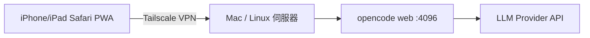

# 實作計畫：在 Apple 裝置上使用 opencode（web UI + Tailscale 遠端存取）

## 1. 背景與目標
- 使用者在 iPhone/iPad 上使用 opencode（開源 AI coding agent）。
- opencode 無法在 iOS 原生執行，官方支援路徑為 `opencode web`（瀏覽器介面 / PWA）。
- 本任務產出一份「可照做」的教學文件，涵蓋伺服器端設定與 iOS 端使用，含 Tailscale 遠端存取與密碼保護。

## 2. 假設（需使用者確認）
1. opencode 伺服器 OS：macOS 或 Linux 或 Windows + WSL2（教學以 macOS/Linux 為主，Windows+WSL 附註差異）。
2. 遠端存取方式：Tailscale（你已同意）。
3. Apple 裝置：iPhone / iPad，iOS 17+。
4. 你已有 LLM provider 的 API key（或計畫用 opencode Zen）。

## 3. 架構設計
- 伺服器端：`opencode web` 預設只綁 127.0.0.1 → 改用 `--hostname 0.0.0.0`（或 `--mdns`）→ 透過 Tailscale 節點存取。
- 認證：`OPENCODE_SERVER_PASSWORD`（+ `OPENCODE_SERVER_USERNAME`）。
- iOS 端：Safari 開啟 `http://<tailscale-ip>:<port>` → 「加入主畫面」變成 PWA。

## 4. 教學文件大綱（opencode-ios-tutorial.md）
1. 事前準備（伺服器、API key、Tailscale 帳號）
2. 安裝 opencode（macOS / Linux / Windows+WSL 三種指令）
3. 啟動 `opencode web`（密碼、hostname、mDNS、開機自動啟動）
4. Tailscale 安裝與設定（伺服器端）
5. iOS 端使用（Safari 連線、加入主畫面、注意事項）
6. 安全注意事項
7. 疑難排解（常見問題表）

## 5. 安全性設計
- 一律要求密碼保護；Tailscale ACL 限定可存取裝置。
- 不直接暴露公網；如需公網存取，改用 Cloudflare Tunnel（文件附註，不實作）。

## 6. 變更範圍
- 在 workspace 根目錄建立 2 個檔案：
  - `implementation_plan.md`（本計畫書）
  - `opencode-ios-tutorial.md`（教學主文件）
- 不修改任何既有程式碼（目前 workspace 為空）。

## 7. 驗證方式
- 對照官方文件（opencode.ai/docs/web）逐項比對指令與旗標。
- 若本機可驗證，實際跑一次 `opencode web` 啟動與密碼保護流程。
- 檢查 Tailscale 安裝指令與現行官方文件一致（技術細節查證）。

## 8. 已知限制與取捨
- iOS PWA 有已知小問題（如官方 issue #35480 safe area），教學中附註但不處理。
- `opencode web` 不支援 iOS 全鍵盤快捷鍵；進階 TUI 操作建議改用 Blink Shell（教學附註）。
- 不實作公網暴露；Tailscale 已滿足遠端需求，更簡單也更安全。
